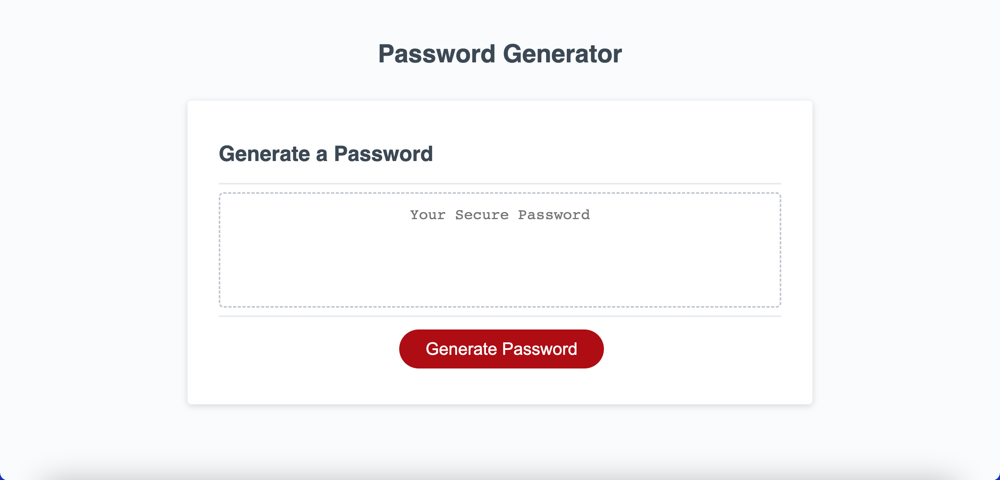

# Password Generator 

## Description

This is a password generator that was coded mainly by Javascript. The generate button creates a password between 8 and 128 characters that could include Uppercase, Numbers, and Special characters based on the user's choice. It uses browser prompts that pop up. It helps solve people create a
hard password that won't be easily hacked into. I learned throughout this entire project that trial and error is essential for success.

## Usage

When you click generate, four prompts should pop up indicating certain length and character sets based on user. This then creates a password.

## Credit

For the CSS & HTML provided, thanks to the bootcamp.

## License

N/A
